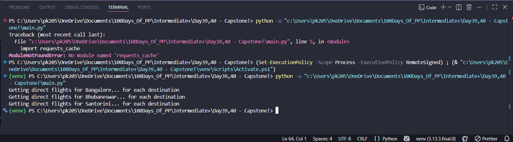
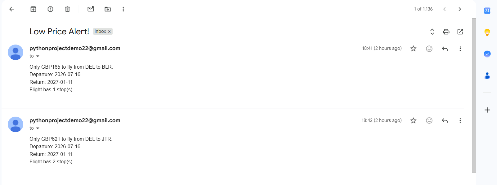
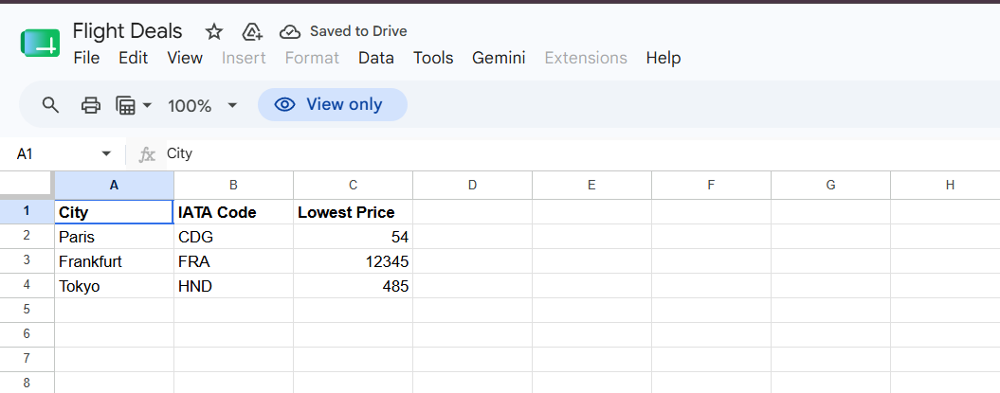

# Flight Club

A Python-based flight price tracker that monitors round-trip flight prices using **SerpAPI** and automatically notifies users via **email** whenever a cheaper flight is found than their target price.

The application stores destination data and user subscriptions in **Google Sheets** using the **Sheety API**, making it easy to manage flight destinations and recipients without modifying the code.

---

## Features

- 🔍 Search live flight prices using SerpAPI (Google Flights)
- ✈️ Prioritizes direct flights and falls back to indirect flights if necessary
- 📊 Stores and updates destination data using Google Sheets (Sheety API)
- 📧 Sends email notifications when a lower price is found
- 👥 Supports multiple subscribed users
- ⚡ Uses request caching to reduce unnecessary API calls
- 🔐 Protects API keys and credentials using environment variables (`.env`)

---

## 🛠 Tech Stack

### Backend

- Python

### APIs

- SerpAPI
- Sheety API

### Libraries

- Requests
- Requests Cache
- python-dotenv

### Notifications

- Gmail SMTP
- Twilio

---

## Project Structure

```text
FlightClub/
│
├── main.py                     # Application entry point
├── data_manager.py             # Google Sheets operations
├── flight_search.py            # Flight search using SerpAPI
├── flight_data.py              # Flight data processing
├── notification_manager.py     # Email & WhatsApp notifications
│
├── requirements.txt
├── .env.example
├── .gitignore
└── README.md
```

---

## Setup

### 1. Clone the repository

```bash
git clone https://github.com/Pranavkr323/flight-club.git
cd flight-club
```

### 2. Install dependencies

```bash
pip install -r requirements.txt
```

### 3. Create a `.env` file

Copy the variables from `.env.example` and add your own credentials.

Example:

```env
SERP_API_KEY=your_api_key
SHEET_ENDPOINT=your_sheety_endpoint
USERS_ENDPOINT=your_users_endpoint
MY_EMAIL=your_email@gmail.com
MY_PASS=your_gmail_app_password
ACCOUNT_SID=your_twilio_sid
AUTH_TOKEN=your_twilio_auth_token
```

### 4. Run the project

```bash
python main.py
```

---

## How It Works

1. Reads destination data from Google Sheets.
2. Retrieves subscribed user email addresses.
3. Searches Google Flights using SerpAPI.
4. Finds the cheapest available flight.
5. Compares the current price with the stored target price.
6. Updates the Google Sheet if a lower price is found.
7. Sends email notifications to all subscribed users.

---

## Notification Example

```
Subject: Low Price Alert!

Only GBP176 to fly from DEL to BLR.

Departure: 2026-08-10
Return: 2027-02-08
```

---

## 🔒 Environment Variables

Sensitive information such as API keys and credentials are stored securely using a `.env` file and are **not included** in this repository.

---

## What I Learned

- Working with multiple third-party APIs
- REST API integration using Python Requests
- Managing application configuration with environment variables
- Sending emails using SMTP
- Using request caching for better performance
- Organizing Python projects into reusable modules
- Managing project dependencies with `requirements.txt`

---

## Screenshots

### Terminal



### Email Notification



### Google Sheet



## License

This project was built for learning purposes as part of the **100 Days of Code: Python Bootcamp** and is shared for educational purposes.
